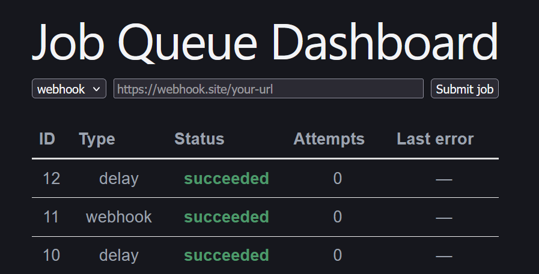

# Job Queue & Scheduling Dashboard

A background job processing system with automatic retries, exponential
backoff, and a real-time dashboard — the same pattern used to handle
webhooks, emails, and async work in production systems.

**Live demo:** https://job-queue-static-site.onrender.com/
(Free-tier hosting — first load may take up to a minute if idle.)

## Screenshot

## Stack
Node.js, Express, PostgreSQL, Redis, BullMQ, React, Socket.io, Docker

## Architecture
See [ARCHITECTURE.md](./ARCHITECTURE.md) for design decisions and tradeoffs.

## Running locally
\`\`\`bash
git clone [your repo URL]
cd job-queue
docker compose up --build
\`\`\`
Visit http://localhost:5173

## Running tests
\`\`\`bash
npm test
\`\`\`